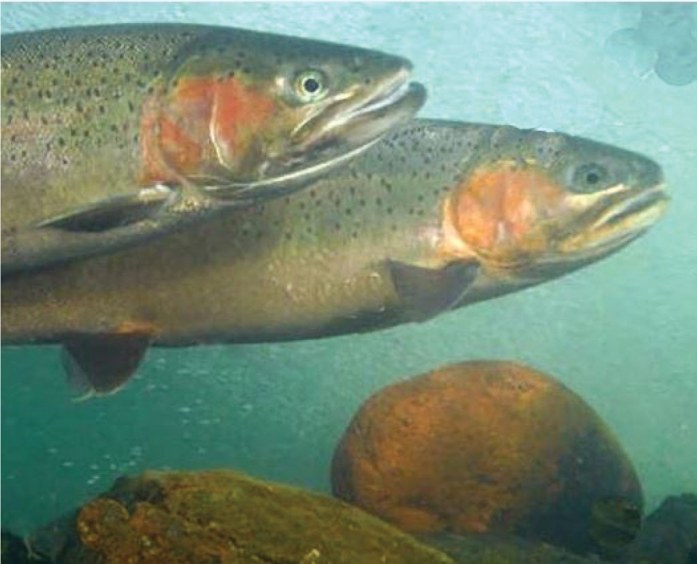
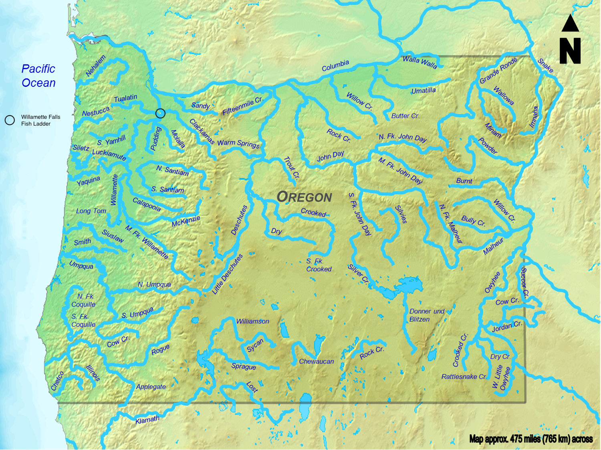

```{r setup, include=FALSE, message = FALSE, warning = FALSE}
knitr::opts_chunk$set(echo = TRUE, message = FALSE, warning = FALSE)

# Attach packages
library(tidyverse)
library(here)
library(rmdformats)
library(knitr)
library(janitor)
library(tsibble)
library(feasts)
library(lubridate)
library(patchwork)
library(cowplot)
```


## **Overview** 



Image of Steelhead salmon at Willamette Falls in Oregon. *[Photo Credit: Northwest Power and Conservation Council - John Harrison] (https://www.nwcouncil.org/news/threat-steelhead)*

This report uses Columbia River DART (daily access in real time) data provided by Columbia Basin Research, part of the University of Washington. The data accessed through the Columbia Basin Research portal comes from a variety of sources, including: U.S. Army Corps of Engineers, NWD and Chelan, Douglas, and Grant County PUDs, Yakima Klickitat Fisheries Project, Colville Tribes Fish & Wildlife (OBMEP), Oregon Department of Fish & Wildlife, and Washington Department of Fish & Wildlife. The goal of the Columbia Basin Research is to assist in the monitoring and evaluation of compliance pursuant to the Federal Columbia River Power System 2004 Biological Opinion Remand Updated Proposed Action (UPA). This analysis includes time series data, seasonal plots, and annual counts by species for Coho, Jack Coho, and Steelhead salmon passage through the fish ladder at Willamette Falls in Oregon from 2001-2010. 
 

**Data Citation:** Columbia Basin Research, School of Aquatic and Fishery Sciences, University of Washington. 2010. DART Adult Passage Graphics & Text. http://www.cbr.washington.edu/dart/query/adult_graph_text


```{r}
# Read in the data and use janitor::clean_names() to convert all names to lower snake case

fish <- read_csv(here("data", "willamette_fish_passage.csv")) %>% 
  clean_names()
```



Map of Willamette Falls fish ladder location. *[Photo Credit: Wikimedia Commons, alterations added by me to indicate location of fish ladder.] https://commons.wikimedia.org/wiki/File:Oregon_Rivers.png*


## Daily Time Series

```{r}
# convert data to time series, first use lubridate to convert to mdy format, then use tsibble to use in time series analysis. 

fish_ts <- fish %>% 
  mutate(date = mdy(date)) %>% 
  as_tsibble(key = NULL, index = date) %>% 
  select(date, coho, jack_coho, steelhead) %>% # select only the columns I am interested in
  replace_na(list(coho = 0, jack_coho = 0, steelhead = 0)) %>%  # replace NA values with zero
  pivot_longer(cols = c(coho, jack_coho, steelhead), # converting into a longer dataframe
               names_to = "species",
               values_to = "count") %>% 
  mutate(species = case_when(species == "coho" ~ "Coho",
                   species == "jack_coho" ~ "Jack Coho",
                   species == "steelhead" ~ "Steelhead"))


# create a static graph of adult passage for coho, jack coho, and steelhead salmon

ggplot(data = fish_ts, aes(x = date, 
                           y = count, 
                           color = species)) +
  geom_line() +
  theme_minimal() +
  theme(legend.title = element_blank()) +
  scale_color_manual(values = c("aquamarine4", "lightsalmon3", "lightsteelblue3")) +
  labs(x = "\nYear\n", y = "\nFish Passage Counts\n")
```

**Figure 1:** Time series graph of *daily* adult passage for Coho, Jack Coho, and Steelhead salmon through the Willamette Falls fish ladder from 2001-2010. 

**Key Findings**

- Steelhead pass through the fish ladder for longer periods each year than Coho or Jack coho, with Steelhead passing primarily from January to June, and Coho and Jack Coho passing through later in the year for shorter time intervals. 

- Steelhead are the most abundant species passing through the fish ladder from 2001-2008.

- There is a spike in counts of Coho passing through the fish ladder in 2009 and 2010. 


## Seasonplots

```{r}
# create a season plot using gg_season() for each of the three species of interest


# wrangle the data to sort fish counts by species per month
fish_month <- fish_ts %>% 
  index_by(yr_mo = ~yearmonth(.)) %>% 
  group_by(species) %>% 
  summarize(monthly_count = sum(count, na.rm = TRUE))

# create a season plot using gg_season() for each of the three species of interest

# coho plot

coho_plot <- fish_month %>% 
  filter(species == "Coho") %>% # group by species instead and then summarize by month
  gg_season(y = monthly_count) +
  labs(y = "\nMonthly Passage \nCounts\n") +
  scale_color_gradient(low = "darkseagreen1",
                       high = "aquamarine4") +
  theme_minimal() +
  theme(legend.position = "left") +
  theme(axis.title.x = element_blank()) +
  ggtitle("Coho") +
  theme(plot.title = element_text(size = 8),
        axis.title.y = element_text(size = 8))
 
# jack coho plot

jack_plot <- fish_month %>% 
  filter(species == "Jack Coho") %>% 
  gg_season(y = monthly_count) +
  labs(y = "\nMonthly Passage \nCounts\n") +
  scale_color_gradient(low = "lightsalmon",
                       high = "lightsalmon4") +
  theme_minimal() +
  theme(legend.position = "left") +
  theme(axis.title.x = element_blank()) +
  ggtitle("Jack Coho") +
  theme(plot.title = element_text(size = 8),
        axis.title.y = element_text(size = 8))

#steelhead plot

steel_plot <- fish_month %>% 
  filter(species == "Steelhead") %>% 
  gg_season(y = monthly_count) +
  labs(y = "\nMonthly Passage \nCounts\n") +
  scale_color_gradient(low = "lightsteelblue3",
                       high = "darkslategray") +
  theme_minimal() +
  theme(legend.position = "left") +
  theme(axis.title.x = element_blank()) +
  ggtitle("Steelhead") +
  theme(plot.title = element_text(size = 8),
        axis.title.y = element_text(size = 8))


# use cowplot to combine all three plots into one final figure

plot_grid(coho_plot,jack_plot,steel_plot,
          cols = 1, nrow = 3)
```

**Figure 2:** Seasonplots showing monthly passage counts of Coho, Jack Coho, and Steelhead salmon from 2001-2010. Legend values correspond to years ranging from 2.5 for 2001 and 10 for 2010. 

**Key Findings**

- Coho salmon passage counts spike in 2009 and 2010 compared to other years, which could be due to improvements in species protection (i.e. fishing limitations). 

- Steelhead salmon primarily pass through the fish ladder between January and July, with counts peaking in May and June. Steelhead have the longest fish ladder seasons of the three species analyzed in this report. 

- Coho and Jack Coho salmon passage begins in August, peaks in September, and ends in November/December. These two species are only observed passing through the Willamette Falls fish ladder during these months (clear seasonality).


## Annual Counts

```{r}
# wrangle the data to calculate fish passage counts by year

fish_annual <- fish_ts %>% 
  index_by(year = ~year(.)) %>% 
  group_by(species) %>% 
  summarize(yearly_counts = sum(count))

# create a finalized figure of annual totals for fish passage

ggplot(data = fish_annual, aes(x = year, 
                               y = yearly_counts, 
                               color = species)) +  
  geom_line(size = 1, alpha = 0.9) +
  theme_minimal() +
  theme(legend.title = element_blank()) +
  scale_color_manual(values = c("aquamarine4", "lightsalmon3", "lightsteelblue3")) +
  labs(x = "\nYear\n", y = "\nFish Passage Counts\n") +
  scale_x_continuous(n.breaks = 10) 
```

**Figure 3:** Annual totals of fish passage counts for Coho, Jack Coho, and Steelhead salmon through the Willamette Falls fish ladder from 2001-2010.

**Key Findings**

- Steelhead salmon abundance has fluctuated the most of the three species from 2001-2010, with high points in 2002 and 2004, hitting a low point in 2009, and showing a slght recovery as of 2010. 

- Coho salmon abundance has remained relatively low and constant from 2001-2008 with a significant spike in abundance between 2008 and 2009.

- Coho Jack salmon abundance has remained relatively constants from 2001-2010 and by far has the lowest abundance of the three species in this analysis. 


